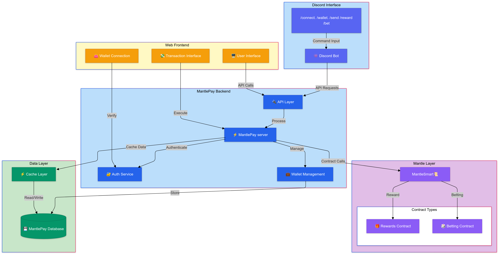

  

<h1 align="center" style="font-size: 60px;">MantlePay</h1>

The all-in-one **Discord Payment Bot** 🔗: Connect wallets, send crypto, reward users, and make fun bets - **all within Discord**!  

---
#  **What is MantlePay?** 🤔 

MantlePay is your **all-in-one Discord bot** 🚀  that brings **Web3** to life inside your favorite servers. Whether you're a DeFi pro, a SocialFi enthusiast, or just here to have fun, MantlePay makes everything easier, smoother, and more engaging. 

**Deployed on the Mantle Network** for fast and secure interactions! ✨ 

---
🔗 **Connect your wallet** Forget complicated wallet setups!With MantlePay, you can **connect your wallet** directly in Discord using a simple command. No stress, no extra steps.
 
💵 **Need to send tokens?** Sending crypto has never been easier.No wallet address? No worries! Use the /send command with a **Discord ID**,
  
🎁 **Want to tip someone** for helping out or being awesome? Tip them instantly without asking for their wallet address. MantlePay’s reward system saves rewards using **Discord IDs**, so users can claim them anytime when they connect their wallet—**zero fuss, zero fees**.  
  
🎰 **Feeling playful?** Set up fun **betting games** for your server and let everyone join in. It’s Web3, simplified and made fun for everyone. 

---

##  Why MantlePay?
The current Web3 ecosystem is **broken** when it comes to user experience:
- Users have to join multiple communities and platforms.
- Connecting wallets, sending payments, and interacting across platforms can be complex.
- Traditional DeFi feels distant and intimidating for the average user.

---

## 🏗️ System Architecture

---

##  Key Aspects 

### 🎯 **DeFi Simplified**
- Users no longer need to deal with complex DApps, wallet addresses, or multiple wallet connections.Seamlessly onboards Web2 users to Web3
- No more sending tokens to the wrong wallet addresses—just use **Discord handles**!🏆

### 💬 **SocialFi for Discord Communities**
- Discord has millions of Web3 enthusiasts, where users help and interact every day.
- Want to **tip someone** for helping you? No need to ask for wallet addresses or wait for replies—just use MantlePay.
- All rewards are **stored by Discord IDs** 🏆in our contracts, so users can claim rewards whenever they connect a wallet—**zero fees** for claiming!🏆

### 🎮 **GamFi for Fun Betting Experiences**

---

## 🔧 Available Commands

1. **/connect**
   - Connect your wallet to MantlePay (no private keys involved).
   - *We do not store or ask for private keys.*

2. **/wallet**
   - Check the wallet connected to MantlePay.
   - **Parameters**: Your address or the address of another Discord user.

3. **/send**
   - Send payments to any Discord user easily.
   - **Parameters**: Amount and @Discord handle.

4. **/reward**
   - Tip or reward a user who helped you.
   - Rewards are stored on the blockchain by the Discord ID.
   - **Parameters**: Amount, @Discord handle, and a message.

   - 🏆 *Best feature*: The rewardee does not need to be registered! They can claim the reward anytime by connecting a wallet.

5. **/bet**
   - Create a bet for fun games within Discord.
   - **Parameters**: Bet topic, initial amount.

6. **/placebet**
   - Join an ongoing bet and place your prediction.
   - Winners share the prize pot, while losers miss out.

---

## 🌐 Smart Contract Addresses  

- **Sample Betting Contract**: [Deployed on Mantle Sepolia Testnet](https://sepolia.mantlescan.xyz/address/0x356c41b7849E76CcCA8fE17f11e9Fbe3e9cd634A)  
- **Sample Rewards Contract**: [Deployed on Mantle Sepolia Testnet](https://sepolia.mantlescan.xyz/address/0xC5C7D1c49E7cF96e0675460ACc22f65039936fEa)

## 🛠️ Tech Stack
- **Network**:Mantle Sepolia Network
- **Frontend**: Next.js (App Router), TypeScript, ShadCN UI
- **Backend**: Node.js, MongoDB
- **Discord Integration**: Discord.js
- **Smart Contracts**: Solidity, Foundry

---

## 🎉 Get Started
MantlePay is live and ready to make your Discord experience seamless and fun. Start sending tokens, rewarding users, and creating bets—**all within Discord**.

**Join the future of SocialFi and DeFi with MantlePay!**

### 📫 Please send a mail or open an issue if you have any quereies (contact-mail : tans861865@gmail.com)

---

